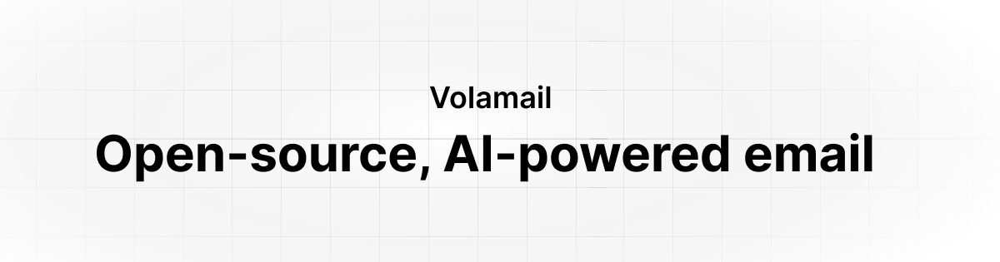

# Volamail

  
  
  
  

Volamail is an open source, self-hostable email provider and editor with AI features. It's built on top of Amazon SES so it can be self-hosted with your own AWS account.

> [!IMPORTANT]
> This project is still in beta. You might encounter bugs, missing features or documentation.

## About the project

## Features

- AI-powered email generation
- Inline AI editing
- Custom domains
- Image prompting
- Import HTML emails
- HTML export
- Project-aware AI context
- Rest API

## Credits

This project is built on top of incredible open source projects:

- [Solid.js and SolidStart](https://github.com/solidjs/solid-start)
- [Vercel AI SDK](https://github.com/vercel/ai)
- [Supabase](https://supabase.com)
- [Kobalte](https://github.com/kobaltedev/kobalte)
- [Ark UI](https://github.com/chakra-ui/ark)
- [Tailwind CSS](https://tailwindcss.com)
- [Astro](https://astro.build)
- [Drizzle ORM](https://orm.drizzle.team)
- [Fumadocs](https://github.com/fuma-nama/fumadocs)

## Contributing

Contributions are welcome! More detailed guidelines will be added in the future. For now feel free to open issues or small PRs to help us improve. We're also open to ideas and suggestions via Discord.

## License

This project is licensed under the MIT License. With Volamail being a COSS project it's possible some parts of the codebase in the future will be licensed under different terms, but all the code you see for now is MIT.
